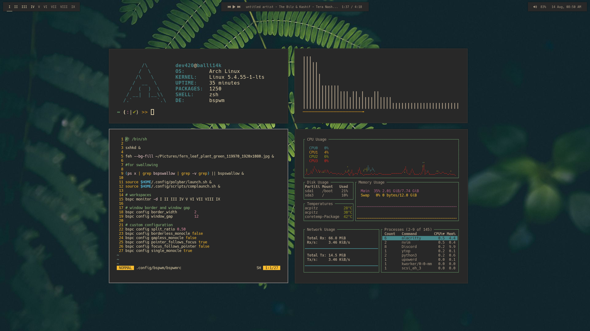

# ~/dotfiles

Here is my Arch Linux configuration

### Tools i used to make my Desktop environment sassy :

| Category                 | Packages/Programs                                                                                                      |
| ------------------------ | ---------------------------------------------------------------------------------------------------------------------- |
| **Distribution**         | Arch Linux                                                                                                             |
| **Window Manager**       | [bspwm](https://github.com/baskerville/bspwm) with [sxhkd](https://github.com/baskerville/sxhkd) as keybindings daemon |
| **Shell**                | Zsh                                                                                                                 |
| **Terminal**             | [Alacritty](https://github.com/alacritty/alacritty)                                                              |
| **Display Manager**      | [LightDM](https://github.com/canonical/lightdm) with [webkit2-greeter](https://github.com/antergos/web-greeter)        |
| **Apps Launcher**        | [dmenu](https://tools.suckless.org/dmenu/)                                                                             |
| **Text Editor**         | Neovim                                                                                                                 |
| **File Manager (CLI)**   | [ranger](http://ranger.github.io/)                                                                                     |
| **File Manager (GUI)**   | PCManFM                                                                                                                |
| **Sound Mixer**         | Pulseaudio                                                                                                             |
| **Sound Control**        | Pavucontrol                                                                                                            |
| **Network Manager**      | [NetworkManager](https://wiki.gnome.org/Projects/NetworkManager/)                                                      |
| **Image Viewer**         | [sxiv](https://wiki.archlinux.org/index.php/Sxiv)                                                                                    |
| **Screenshot App**       | [scrot](https://github.com/resurrecting-open-source-projects/scrot)                                                    |
| **System Monitor (CLI)** | ytop                                                                                                                   |
| **Notification-daemon**  | [Dunst](https://wiki.archlinux.org/index.php/Dunst)                             |

### Here is the screenshot



### Here is all other details

-   **WM**: bspwm
-   **Terminal**: Alacritty
-   **Font**: [Hack](https://sourcefoundry.org/hack/)
-   **Color Scheme**: [Gruvbox (Dark)](https://github.com/morhetz/gruvbox)
-   **Compositor**: Yeah
-   **AUR Package Manager**: [Yay](https://github.com/Jguer/yay)

**Wallpaper [here](fern_leaf_plant_green_119970_1920x1080.jpg)**.

# To have polybar you have to Install following packages:
-   **Font**: [Cozette](https://aur.archlinux.org/packages/cozette-otb),[font-Awesome](https://www.archlinux.org/packages/community/any/ttf-font-awesome/),[IPAGothic](https://www.archlinux.org/packages/?name=otf-ipafont)
-   **Spotify**: Get [playerctl](https://aur.archlinux.org/packages/playerctl-git/) from aur repository
## To clone my repo do as following

1. Clone this in your home directory

```console
$ git clone https://github.com/harshbaliyan126/dotfiles.git
```

2. Copy the config files to their respective directories(-u stands for update so it's gonna update your present directories )

```console
$ cd ~/dotfiles
$ cp -ur bspwm nvim picom polybar sxhkd spicetify ~/.config
$ cp .Xresources .xbindkeysec .xprofile .zshrc ~
```
3. Then simply reboot

```console
$ reboot
```
